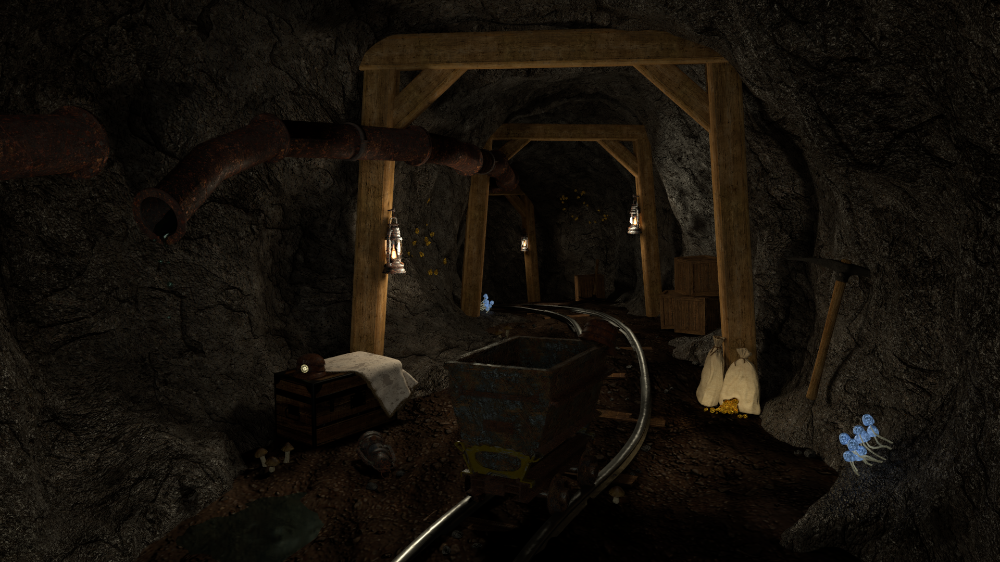
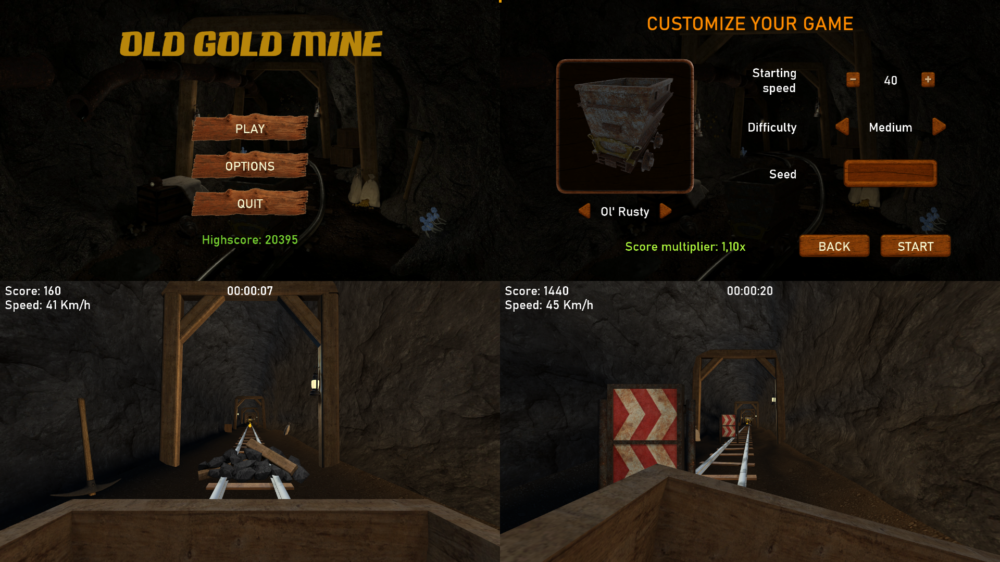

# The Old Gold Mine

`oldgoldmine` is a project that started as a university assignment for the Computer Graphics course at PoliTO (in 2019), but has been additionally worked on and improved after the delivery, going beyond the original requirements.

The project goal was two-fold: we had to create a 3D environment and scene from scratch using [Blender](https://www.blender.org/), and then create a simple game set in the same environment (sharing some of the assets) without using an already available game engine (only libraries and frameworks were allowed).

All the final renders of the Blender scene can be found in the `oldgoldmine-scene/Scene` folder, while the game can be played by simply downloading the provided package from the [release](https://github.com/pgallo725/oldgoldmine/releases) page of this repository.

## Scene

Despite being our first "real" Blender scene created without following any tutorial and only using textures that we could find online for free, the choice of an old gold mine gave us the opportunity to create a really atmospheric and nice-looking environment. The results are good but definitely far from perfect, and any experienced 3D artist will easily be able to spot many mistakes that we made due to our inexperience.

The scene was supposed to be a showcase of our Blender skills and therefore was created mixing as many techniques as possible, including:
- Box modeling and boolean operators
- Proportional editing and lattice deformation
- Sculpting
- Texture and vertex painting
- Displacement mapping (for the cave ground and rocky walls)
- Particle systems
- Rigidbody physics
- Cloth physics
- Fire and smoke simulation (for the lanterns)
- Fluid simulation (for the liquid dripping from the pipe into the puddle on the left)

> **NOTE:** The scene was originally created and rendered using Blender 2.79, but has since been ported to Blender 2.91 because some of the materials were not working properly in the latest version. Renders still refer to the first (delivered) version, and there might be some very small inconsistency with the `Scene.blend` file currently hosted in this repository.

## Game

The **OldGoldMine** game is a simple "endless runner" where the player is placed inside a minecart that travels inside an infinite, procedurally generated cave, filled with obstacles and gold ores. The player has to dodge the obstacles while collecting as many gold nuggets as possible, in order to reach new highscores and unlock more minecart models to use.

The game has been developed using the [MonoGame](https://www.monogame.net/) framework; all 3D assets in use are tweaked versions of those used in the Blender scene or crated ad-hoc for this purpose and most textures have been generated by baking the Blender materials and lighting before exporting.

### Features

- Procedural, seed-based, endless level generation ✔️
- 3 difficulty levels (Easy, Medium, Hard) ✔️
- 6 unlockable minecart models for the player ✔️
- Soundtrack and sound effects ✔️
- Keyboard, mouse and controller support ✔️
- In-game options menu for audio and video settings* ✔️
- Custom built UI framework and core engine features ✔️

> \* *While there are options for adjusting the game's resolution, the UI does not scale to all possible screen resolution and therefore the experience might be sub-optimal. Additionally, three display modes are available (Windowed, Fullscreen, Borderless) but may exhibit some issues depending on many factors.*

### Controls

- **Jump:** W or UpArrow or Space (keyboard), DPadUp or LeftThumbstickUp or A (gamepad)
- **Crouch:** S or DownArrow or LeftControl (keyboard), DPadDown or LeftThumbstickDown or B (gamepad)
- **Dodge left:** A or LeftArrow (keyboard), DPadLeft or LeftThumbstickLeft (gamepad)
- **Dodge right:** D or RightArrow (keyboard), DPadRight or LeftThumbstickRight (gamepad)
- **Free camera:** F (keyboard), Back (gamepad)
- **Look around:** Mouse, Right Thumbstick (gamepad)
- **Pause:** ESC (keyboard), Start (gamepad)
- ***Debug view:** G (keyboard)*

### Supported platforms

The game can be played on any system that runs **.NET Core 3.1**, with an ***x86*** or ***x64*** CPU and a graphics device that supports the DirectX 11 feature level (it might also work with older devices back to DirectX 9, but it has not been tested to confirm).

## Maintained status

This project has been developed as a university assignment and then extended/improved as a personal side-project. Therefore it is no longer being actively maintained and no support is given to fix compatibility issues of both the Blender scene or the game itself.

You are always free to open a [GitHub issue](https://github.com/pgallo725/oldgoldmine/issues) to report any problem with the software and, in case, contribute with your own [pull requests](https://github.com/pgallo725/oldgoldmine/pulls) to this project.
